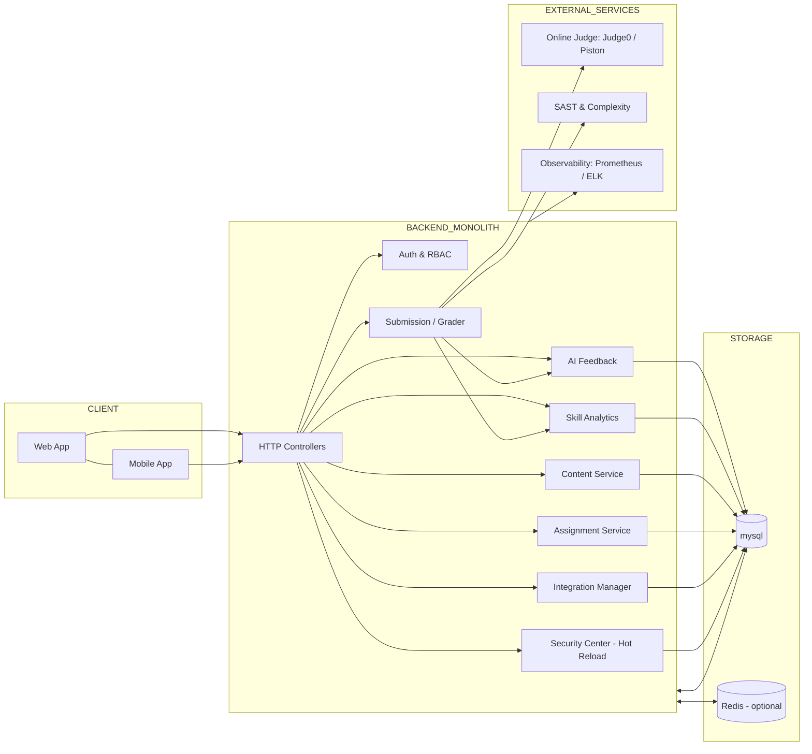
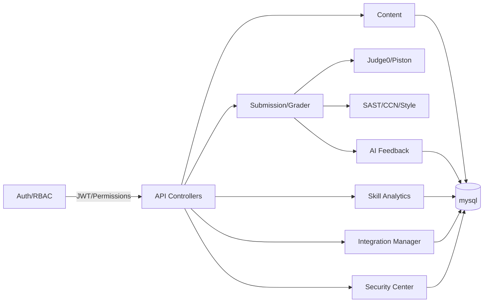
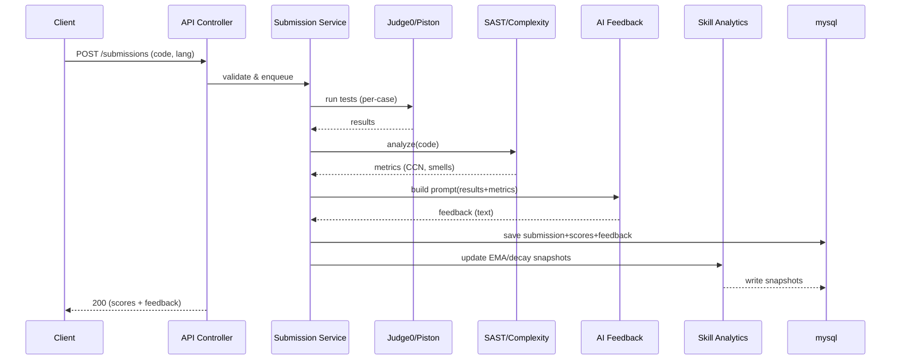

# APSAS
hệ thống Automated Programming Skills Assessment System (APSAS) được đề xuất nhằm tự động hóa việc chấm code, đánh giá kỹ năng và đưa ra phản hồi cá nhân hóa, giúp nâng cao trải nghiệm học tập cho sinh viên và giảm tải công việc cho giảng viên
## 2) Backend Architecture (Monolith‑Modular, DDD‑oriented)

> Spring Boot 3, Java 17+, PostgreSQL, WebClient, JWT, Flyway, Micrometer. Một app duy nhất nhưng chia **bounded contexts** (có thể tách thành microservices sau).

## 2) Backend Architecture (Monolith-Modular, DDD-oriented)

> Spring Boot 3, Java 17+, PostgreSQL, WebClient, JWT, Flyway, Micrometer.

### 2.1 High-Level System Flow



### 2.2 Component Responsibility Map



### 2.3 Sequence – Grading Pipeline (rút gọn)



---

## 3) Module Structure (source tree)

```text
src/main/java/com/apsas/
├─ common/                 # DTO, exception, mapper, utils, web handlers
├─ config/                 # OpenAPI, WebClient, Jackson, CORS (hot)
├─ security/               # JWT + RBAC
├─ auth/                   # register/login/refresh
├─ content/                # content + version + review/publish
├─ assignment/             # assignment + deadline + rubric
├─ submission/             # grading orchestrator + judge clients + analysis
├─ feedback/               # AI feedback
├─ skills/                 # EMA/decay + snapshots + APIs
├─ integration/            # connectors + logs + test
├─ secconfig/              # security policy center (hot-reload)
├─ sysconfig/              # system change → CI/CD
└─ observability/          # links/proxy to dashboards
```

---
